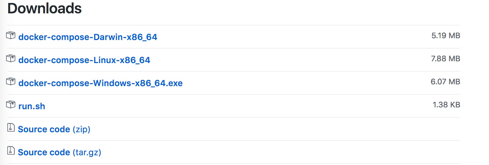

# ELK FOR DOCKER

Run the latest version of ELK stack with docker and docker-compose.

## Requirements

* 1、 docker
* 2、docker-compose
* 3、clone this repository

### Docker

refer to [https://docs.docker.com/engine/installation/linux/ubuntu/#install-from-a-package](https://docs.docker.com/engine/installation/linux/ubuntu/#install-from-a-package)

### Docker-compose

[Download](https://github.com/docker/compose/releases)


and run:

```shell
sudo mv docker-compose-Linux-x86_64 /usr/local/bin/docker-compose
sudo chmod +x /usr/local/bin/docker-compose
```

### clone

```shell
git clone https://github.com/qianlnk/elk.git
```

## Increase `vm.max_map_count` on your host

You need to increase the `vm.max_map_count` kernel setting on your Docker host.
To do this follow the recommended instructions from the Elastic documentation: [Install Elasticsearch with Docker](https://www.elastic.co/guide/en/elasticsearch/reference/current/docker.html#docker-cli-run-prod-mode)

## SELinux

On distributions which have SELinux enabled out-of-the-box you will need to either re-context the files or set SELinux into Permissive mode in order for docker-elk to start properly.

For example on Redhat and CentOS, the following will apply the proper context.

```shell
$ chcon -R system_u:object_r:admin_home_t:s0 elk/
```

## Usage

start ELK stack with docker-compose:

```shell
docker-compose up
```

or run it in background

```shell
docker-compose up -d
```

usually, I like run it in tmux.

## Ports

* 5000: logstash TCP input
* 5044: logstash filebeat input
* 9200: elasticsearch HTTP
* 9300: elasticsearch TCP
* 5601: kibana

## filebeat

### install

[Download](https://www.elastic.co/downloads/beats)

update filebeat.yml

```yml
filebeat.prospectors:

- input_type: log

  paths:
    - /Users/qianlnk/go/src/Nami/logs/nami.log
  fields:
    service: nami #use this field to flag which service is the log belong to.

- input_type: log
  paths:
    - /Users/qianlnk/go/src/Nami/franky/logs/workers.log
  fields:
    service: worker

output.logstash:
  enabled: true
  hosts: ["10.17.1.67:5044"]
```

## Config

### logstash

The logstash config file is stroed in `logstash/config/logstash.yml`
and config `input` `output` in `logstash/pipeline/`.

### kibana

The kibana config file is stored in `kibana/config/kabana.yml`

### elasticsearch

The elasticsearch config file is stored in `elasticsearch/config/elasticsearch.yml`

### How to stored elasticsearch data

add valumes to docker-compose.yml

```yml
volumes:
    - /path/to/storage:/usr/share/elasticsearch/data
```

This will store elasticsearch data inside `/path/to/storage`

### How to scale up the elasticsearch cluster

The Elasticsearch container is using the [shipped configuration](https://github.com/elastic/elasticsearch-docker/blob/master/build/elasticsearch/elasticsearch.yml).